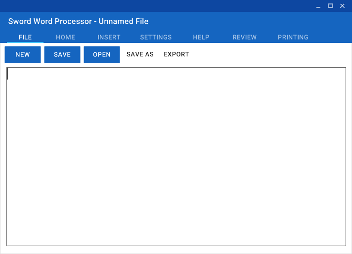

# Sword
## What is Sword?
Sword is an open-source word processor, written in Visual Basic .NET, with features such as a Material Design-inspired graphical user interface, support for reading and writing Microsoft Word 1997 - 2003 Documents, among many others. It also features the ability to create tables, import images from the internet, and more!

## In Development
Sword is a hobby project, so it's still being worked on. As a result, more features are constantly being added, old features improved and reworked to be easier to use, and even the community can get involved! If you happen to feel like helping, why not fork this repo, code some cool new things, and submit a pull request? If it's cool, chances are I'll accept! ... Or, it would be great if you could report bugs in the issues tracker, if you aren't a super-techy person. :)

I occasionally post about Sword on my website (http://damianheaton.com) and on my Twitter (http://twitter.com/scratso) too, if anyone is interested in those.

Sword is distributed under the GNU GPL v3.

Screenshot:
